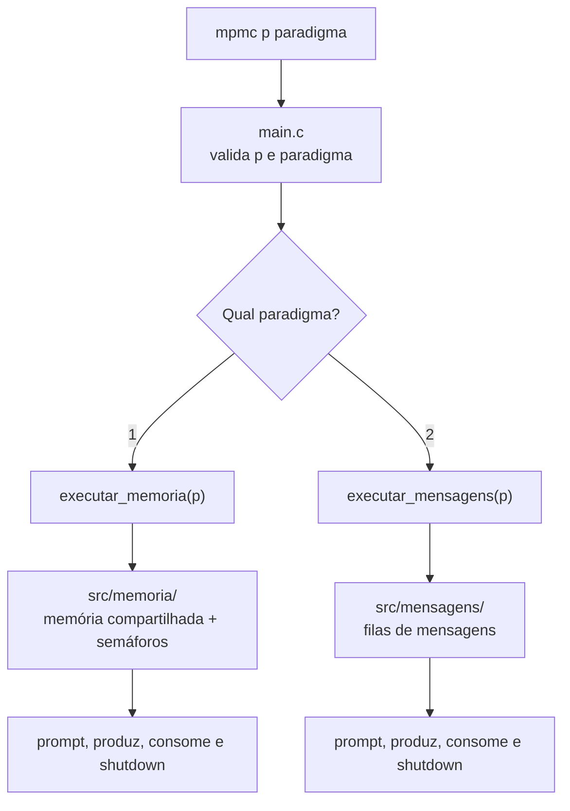

# mpmc-unb

Implementação do problema de múltiplos produtores e múltiplos consumidores usando memória compartilhada, semáforos e filas de mensagens em C.

## Arquitetura

O projeto gera um único programa final, `mpmc`. O `main` será responsável apenas por validar os argumentos iniciais e encaminhar a execução para o paradigma selecionado. Depois disso, cada módulo controla seu próprio prompt, processos, mecanismos IPC, estatísticas e encerramento.



Os módulos são independentes. A integração entre as duas frentes acontece somente pelas funções públicas declaradas em `include/memoria.h` e `include/mensagens.h`.

## Estrutura de diretórios

```text
mpmc-unb/
├── include/
│   ├── memoria.h
│   └── mensagens.h
├── src/
│   ├── main.c
│   ├── memoria/
│   │   └── memoria.c
│   ├── mensagens/
│   │   └── mensagens.c
│   └── stubs/
│       ├── memoria_stub.c
│       └── mensagens_stub.c
├── Makefile
└── README.md
```

Os stubs permitem compilar e testar um paradigma mesmo quando o outro ainda não estiver implementado.

## Compilação

| Comando | Módulos utilizados | Executável |
|---|---|---|
| `make mensagens` | mensagens reais + stub de memória | `build/mpmc-msg` |
| `make memoria` | memória real + stub de mensagens | `build/mpmc-shm` |
| `make completo` | ambas as implementações reais | `build/mpmc` |
| `make clean` | remove os arquivos gerados | - |
